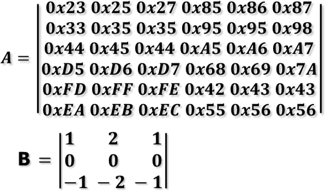
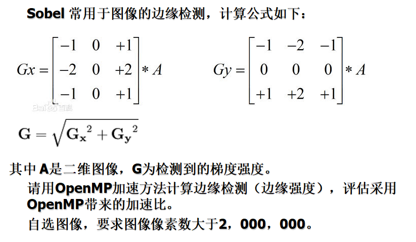
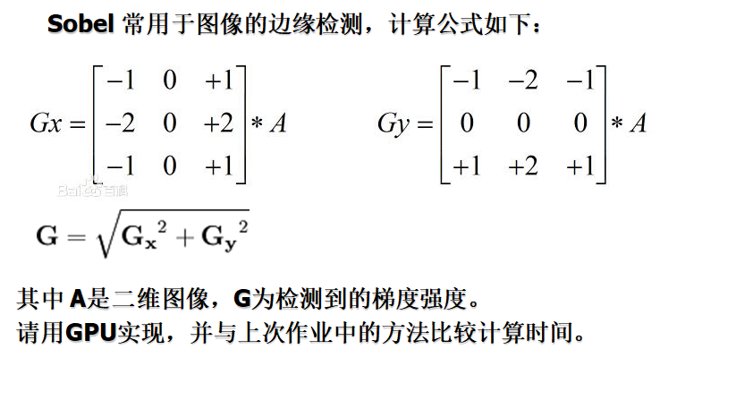

## Embedded Microprocessor System Homework

北京大学嵌入式与微处理系统课程作业【更新中】

### Homework1

请在keil，或segger模拟器上调试并运行一个你以前所写的C（或C++）程序。

- 列出编译和调试过程中遇到的问题及解决措施。

- 提交程序源

### Homework2

在下列三题中选择一道：

1. 导入一幅256X256的8bit灰度图像，请在ARM 处理器上编程，使图像顺时针旋转45度，并导出图像；

2. 在ARM处理器上（模拟器或实际开发板），编译并调试性能测试程序dhrystone；

3. 在ARM处理器上（模拟器或实际开发板），编译并调试性能测试程序coremark；

### Homework3

二选一：

1. 用ARM汇编设计程序，验证ARM处理器的ARM指令和Thumb指令下执行任意两个8位无符号数相乘结果的一致性。

2. 已知 A为数组B为卷积核。请用汇编程序计算，C=A*B（卷积）

### Homework4

为了节省内存，避免内存中出现空洞，常采用不对齐的方式分配内存。然而，不对齐的数据，无法用指令“LDR”和“STR”正确从内存装载和写入内存。

​    （1）请编写两条宏定义指令“LDRUA”和“STRUA”，能够将32位数据正确从内存装载和写入内容，而不论数据是否对齐。

​    （2）请用编写程序，用实际数据验证两条自定义指令。

### Homework5

编写上电后能够启动的程序并在实验板上运行。

（1）程序分为C和汇编两个部分。

（2）汇编部分对系统进行初始化 （s2410a.s）。

（3）C部分控制实验板上LED循环显示。

（4）通过仿真器下载程序到RAM中运行，观察结果。

（5）将程序写入目标板NOR FLASH，实现上电后自动启动。

### Homework6

1. 编写下列函数,然后编写程序通过软中断方式调用，计算出结果。 ：

 	（1）64位带进位的加法运算（asm）；
 	
 	（2）两个32位数相乘，结果为64位的乘法运算（C 或 asm）。

2. 阅读 u-boot-2015.10\arch\arm\cpu目录下某处理器相关的start.s文件，或者其他boot文件，请说明：如果在不同处理器间移植u-boot，需要修改 start.s中的哪些语句？请在文件中标注出来。

### Homework7

在ARM处理器上, 运行dhrystone测试程序：

（1）分别选择o0, o1, o2, o3 优化选项，比较所生成程序的大小和执行速度。

（2）选择其中一个函数，尝试分析o0和o3选项所生成的汇编程序的结构和指令数的差别。

### Homework8

在评估版上调试键盘中断程序（可选触屏）

### Homework9

请用OpenMP加速方法计算边缘检测（边缘强度），评估采用OpenMP带来的加速比。

### Homework10

用CUDA编程，实现Sobe算子对图像的操作（完成与实验9相同的功能）。

