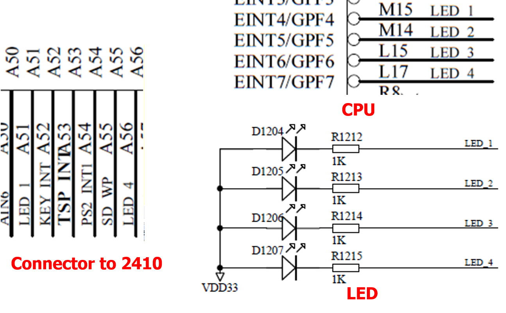
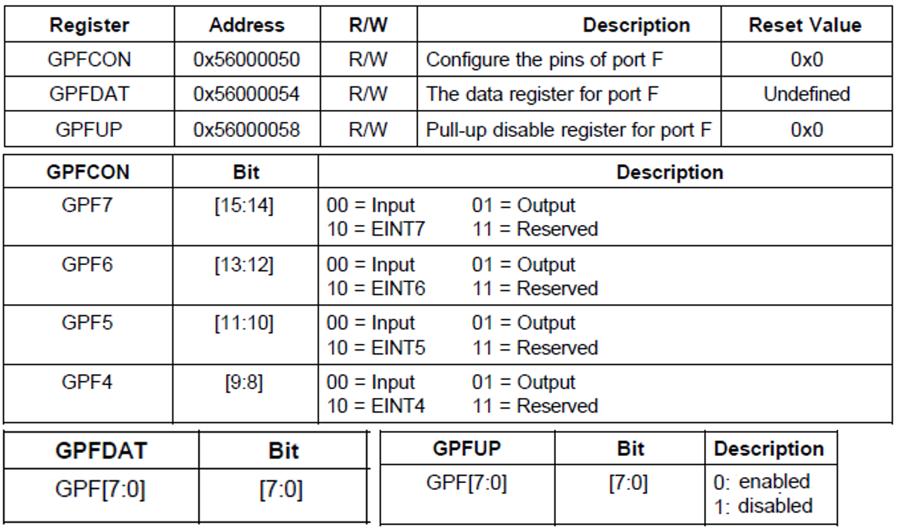
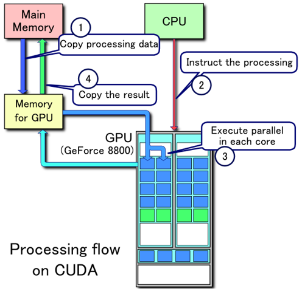
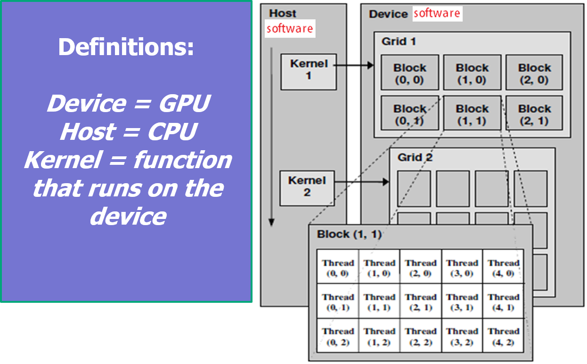
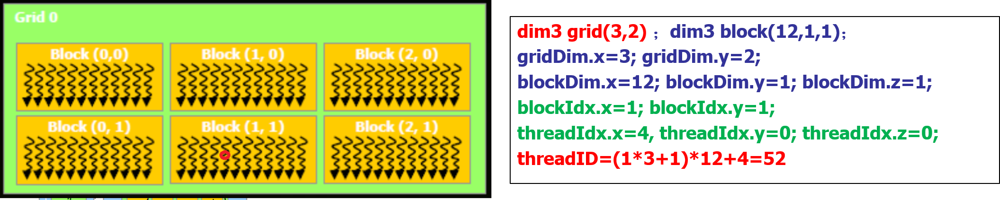
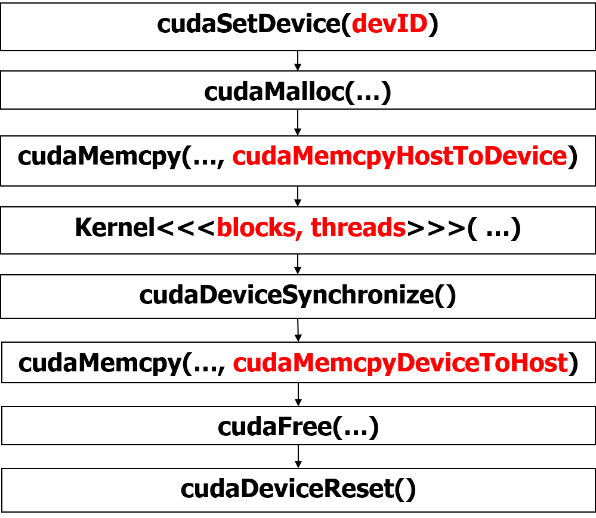
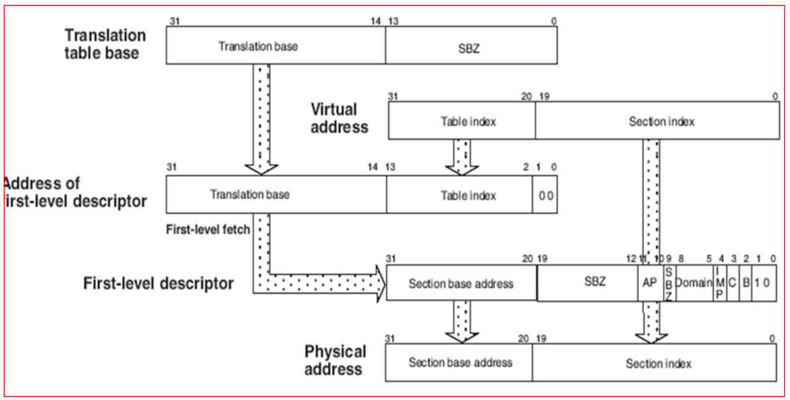

# 考试题型回忆（2021）

- 选择30个，每个1分，
  - 一些容易忽视的点，程序优化，处理器各种模式（例如Sleep）等，其他的都是正常的题
- 填空30个，每个1分，给寄存器和内存，各种指令执行的结果填空
- 简答题，两个，每个10分，一个startup.s（作用？如何进到main函数？），一个SWI（判断程序对错？其中一条指令什么作用？）
- 代码题20分，改写函数，OpenMP十分，CUDA十分，这次考的二维数组sum求和，用reduction

# 嵌入式重难点总结

## 软中断流程

1. 通过`__swi(中断号) function`给中断函数指定中断号（一般在C代码中撰写）

2. 调用function时，相当于执行了`SWI 中断号`指令

3. 再执行`SWI`之前需要先注册中断程序，即把处理软中断的程序（SWI_handler）地址放到`0x08`软中断向量表地址上

4. 注册之后执行`SWI`的时候，会执行`0x08`中断向量地址上存放的跳转指令（`B SWI_handler `），即跳转到SWI_handler；同时将function的参数传递到寄存器内（如果参数不超过4个），超过4个应该存放到内存

   ```c
   // 中断注册程序
   unsigned Install_Handler (unsigned *handlerloc, unsigned *vector)
   {  
       unsigned vec, oldvec;
       vec = ((unsigned)handlerloc - (unsigned)vector - 0x8)>>2;	// 确保中断处理函数地址偏移在26位以内：正负32M
       if ((vec & 0xFF000000) != 0)	// 取低24位，即中断服务程序地址
        { return 0;}
       vec = 0xEa000000 | vec;			// 0xEa 应该时跳转指令B的操作码，这里表示跳转指令：”B handlerloc“
       oldvec = *vector;				 
       *vector = vec;					// 将中断向量表中断向量内写入跳转指令的编码，即vec
       return (oldvec);
   }
   ```

5. 跳转后，`SWI_handler`需要干五件事：

   - 1）将保存函数参数的寄存器以及lr寄存器存放到堆栈里保存，
   - 2）通过`BIC`指令获取中断号放置在r0寄存器，
   - 3）将堆栈指针保存到r1，
   - 4）跳转到要执行function的处理函数中（C_SWI_handle）加密，并将r0，r1寄存器作为函数参数传递
   - 5）处理完中断函数后恢复现场

```assembly
SWI_Handler
        STMFD      sp!,{r0-r12,lr}		;保存现场
        LDR        r0,[lr,#-4]          ;获取 SWI 指令
        BIC        r0,r0,#0xff000000    ;参数1，NUM
        MOV        R1, SP               ;参数2，传递堆栈指针
        BL C_SWI_Handler                ;To Function
        LDMFD      sp!, {r0-r12,pc}^	;处理完中断恢复现场，将最初的lr->pc，继续执行SWI指令的下一条指令
        END
```

6. `C_SWI_handle`接受中断号和堆栈指针，通过堆栈指针开始从堆栈中获取参数数据，根据中断号选择计算的程序逻辑，计算完成将结果再次写入堆栈

   ```c
   void C_SWI_handler (int swi_num, int *reg )
   {   switch (swi_num)
       {
           case 0 : 
               ……           /* SWI number 0 code */
                       break;
               case 1 :                 
               ……           /* SWI number 1 code */
                       break;
           ……
               default :   
               break；		/* Unknown SWI - report error */
       }
       return;
   }
   ```

   或

   ```assembly
   C_SWI_Handler 
           STMFD   sp!,{r0-r12,lr}
       	CMP    	r0,#MaxSWI          ; Range check
           LDRLE  	pc, [pc,r0,LSL #2] 	;(PC -> DCD SWInum0)
       	B       SWIOutOfRange 
   SWIJumpTable    
   		DCD    SWInum0
           DCD    SWInum1
   SWInum0   ; SWI number 0 code
           B    EndofSWI
   SWInum1   ; SWI number 1 code
           B    EndofSW
   EndofSW 
   		SUB 	lr, lr, #4
           LDMFD   sp!, {r0-r12,pc}^
           END
   ```

7. 最后从堆栈中取出计算结果放到寄存器r0中

8. 中断结束，从堆栈中恢复现场，继续执行`SWI`指令后的指令

## 系统启动流程

以`S3C2410A`处理器的启动文件[startup.s](./startup.s)为例.

1. 系统上电后，先进行复位Reset

2. 设置PC的初始值0，执行Reset_Handler

3. Reset_Handler初始化需要干以下几件事

   - 1）设置WT_Setup（Watchdog Timer）、CLK_Setup（Clock）、MC_Setup（Memory Controller）、PIO_Setup（IO port）、Stack_Setup（Stack/Heap）
   - 2）设置异常中断的模式的栈指针，包括Undefined、Abort、FIQ、IRQ、Supervisor、User
   - 3）设置SRAM

   ```assembly
   				BL INISDRAM
   ```

   - 4）堆栈空间的设置

   - 5）进入C程序代码(__main -> init -> main)

   ```assembly
   IMPORT  __main
                   LDR     R0, =__main
                   BX      R0
   ```

- 如果调试时无法进入main，可能的原因是什么？
  - main单词拼写错误
  - 启动代码不对
  - 没有将main.c文件添加到工程文件中
- Startup.s文件的功能和作用？
  - 设置中断向量与中断服务程序地址
  - 分配堆栈空间
  - 设置时钟，看门狗Timer，内存控制，IO端口
  - 设置中断入口IRQ_Entry
  - 实现Reset_Handler
- BootLoader移植需要修改什么代码？
  - 管理和控制处理器内部设备的**寄存器地址和数值**。
  - 不同处理器之间**有差别的地方**都需要进行修改。

## LED显示实验

### 硬件配置

- LED连接



- LED连接
  - LED1  <--> GPF4
  - LED2  <--> GPF5
  - LED3  <--> GPF6
  - LED4  <--> GPF7
- LED 控制
  - 0  -> on
  - 1  -> off

- GPF控制(GPIO 寄存器)



```
GPFCON (4-7 Output):		0b 0101 0101 XXXX XXXX
GPFUP  (4-7 No concern): 	0b XXXX XXXX
GPFDAT (4-7 on): 			0b 0000 XXXX
GPFDAT (4-7 off): 			0b 1111 XXXX
```

### C代码

- 4个LED等循环闪烁（周期2秒），详细解释见注释

```c
#include<stdlib.h>	
#include<stdio.h>
int delay(int times); 	// 声明延时函数

// 注意这两个地址是根据所给的板子型号的手册表格上查找，根据表格赋值
int *rGPFCON = (int *) 0x56000050;	// rGPFCON配置哪些引脚需要使用，采取的模式是什么（00:Input,01:Output）,LED显示即采用输出01
int *rGPFDAT = (int *) 0x56000054;	// rGPFDAT配置相应引脚输入的信号是高电平还是低电平，具体是高电平亮还是低电平亮看LED电路连接，本次实验的LED电路可以看出，LED引脚低电平时灯亮，要根据具体电路分析

void main( void)
{
	*rGPFCON=0x5500;	// 0x5500 = 0b0101_0101_0000_0000;高八位的四个引脚（GPF4-7）都是01模式，即输出模式，结合CPU电路可知，LED与引脚的连接（例如：LED1对应GPF4）
	while(1)
	{
		*rGPFDAT = 0x00;	// 0x00 = 0b0000_0000;高4位对应GPF引脚的输入Data信号，0表示输入低电平，此时灯亮
		delay(1000); 		// 延时1000ms，即1s
		*rGPFDAT = 0xf0;	// 0xf0 = 0b1111_0000;高4位对应GPF引脚的输入Data信号，1表示输入高电平，此时灯灭
		delay(1000);
	}
}

int delay(int times)	// 定义延时函数
{
	int i,j;
	for(i=0;i<times;i++)
		for(j=0;j<times;j++)
		{
		
		}
		return 1;
}
```

- 知道每个引脚作用后，很容易实现想要的灯闪方式：

```c
// 知道每一位的具体作用，那么想让等怎么亮就让那一位数据（Data）信号给0即可
// 例如：实现一个简单的流水main函数
int main(void)
{
	*rGPFCON=0x5500;
	while(1)
	{
		int i;
		*rGPFDAT = 0x10;
		delay(500);

		for(i=1; i<=4; i=i+1){
			*rGPFDAT <<= 1;
			delay(500);
		}
		for(i=1; i<=4; i=i+1){
			*rGPFDAT >>= 1;
			delay(500);
		}
	}
	return 1;
}
```

### 注意事项

- 一定要结合电路图判断时**高电平有效还是低电平有效**，同时看**LED连接的是哪些引脚，并在表格中确定这些引脚是`GPFCON`的哪些位**
- 一定要在给出的表格确定`*rGPFCON`和`*rGPFDAT`的**初始地址**，不同板子地址不一样
- 一般LED显示相应的`GPFCON`使用的**引脚位置`01`，表示输出，但是具体还是要看一下表格确认一下**，以免有的板子`01`就不是输出
- 最后通过`GPFDAT`（8位）传送数据信号，注意这个变量位数一般是`GPFCON`（16位）的一半，**引脚关系也是对应的**，例如`GPFCON`最高两位和`GPFDAT`最高一位都表示`GPF7`引脚，再根据高低电平，相应位置传递0或1即可。
- 注意C语言指针变量赋值的格式。

## OpenMP

- #pragma
  
  - parallel：表示这段代码将被并行执行；
  - for：表示将循环计算任务分配到多个线程中并行执行；
  - sections：用于实现多个结构块语句的任务分担；
  - parallel sections：类似于parallel for；
  - single：表示一段只被单个线程执行的代码；
  - critical：保证每次只有一个OpenMP线程进入；
  - flush：保证各个OpenMP线程的数据映像的一致性；
  - barrier：用于并行域内代码的线程同步，线程执行到barrier时要停下等待，直到所有线程都执行到barrier时才继续往下执行；
  - atomic：用于指定一个数据操作需要原子性地完成；
  - master：用于指定一段代码由主线程执行；
  - Thread private：用于指定一个或多个变量是线程专用。
  
- 基本使用

  - `#pragma omp parallel for`   ⭐⭐⭐⭐⭐

  ```c
  int step = 100;
  int _tmain(int argc, _TCHAR* argv[])
  {
     int i;						// 注意int i 不要再for循环里面写int i = 0
     #pragma omp parallel for
     for (i = 0; i< step; i++)
     {
         printf("i = %d\n", i);
     }
     return 0;
  }
  ```

- 为了防止共享数据导致并行抢占改写，需要使用：

  - `#pragma omp parallel for private(共享变量)`   ⭐⭐⭐

  ```c
  ifirst = 10;
  int k[600];
  for(j = 0; j <= 60; j++)
  {
  #pragma omp parallel for private(i2)
  	for(i=0;i<6000000;i++){ 
       i2 = i-(i/600)*600;
       k[i2] = ifirst + i;
  	}
  }
  ```

  - `share`共享不能用于类似sum求和的方式

  ```c
  float sum = 0.0;
  float a[10000],b[10000];
  for(int j=0;j<10;j++)
  { 
  	sum=0.0;
  	#pragma omp parallel for shared(sum)
     for(int i=0; i<10000; i++) {	// 注意int不要写在for循环，”int i;“在for外面声明
       sum += a[i] * b[i];
     }
  	printf(“j=%d, sum=%f\n”,j,sum);
  }
    return sum;
  ```

  - `critical`每次让一个线程去操作，即让下一行代码串行

  ```c
  float sum = 0.0;
  flaot a[10000],b[10000];
  for(int j=0;j<10;j++)
  {
  	sum=0.0;
  	#pragma omp parallel for shared(sum)
     	for(int i=0; i<N; i++) {
  	#pragma omp critical
       	sum += a[i] * b[i];
     	}
  	printf(“j=%d, sum=%f\n”,j,sum);
  }
  return sum;
  ```

  - `reduction`让所有线程在最后统一执行某一操作，例如：求和”+：“  ⭐

  ```c
  float dot_prod(float* a, float* b, int N) 
  {
    	float sum = 0.0;
  	#pragma omp parallel for reduction(+:sum)
     	for(int i=0; i<N; i++) {
  		sum += a[i] * b[i];
     	}
    	return sum;
  }
  ```

- `barrier`用于并行域内代码的线程同步，线程执行到barrier时要停下等待，直到所有线程都执行到barrier时才继续往下执行

  ```c
  #pragma omp parallel private(myid,istart,iend)
  myrange(myid,istart,iend);
  for(i=istart; i<=iend; i++){
     a[i] = a[i] – b[i];
  }
  #pragma omp barrier
  myval[myid] = a[istart] + a[0]
  ```

- `schedule`分配线程执行

  - `static`：线程按顺序分配，线程内数据处理顺序也按照for循环顺序分配
  - `dynamic`：线程随机分配，线程内数据处理顺序也按照for循环顺序分配
  - `guided`：线程和线程内数据处理顺序都是随机分配

## CUDA

- CUDA处理数据过程

  - Copy data from main mem to GPU mem.
  - CPU instructs the process to GPU.
  - GPU execute parallel in each core. 
  - Copy the result from GPU mem to main mem.

  

- CUDA编程基础代码
  - `<<<blk,thr>>>`中，`blk`表示需要使用的block数目，`thr`表示每个使用的block用多少个线程使用

```c
//hello_world.cu: 
#include <stdio.h> 

__global__ void hello_world_kernel()	// CUDA执行的核（kernel）函数需要加__global__
{ 
    printf(“Hello World\n”); 
}
	
int main() 
{ 
     hello_world_kernel<<<1,1>>>(); 	// 函数调用需要指定<<<Blk, Tid>>>	
}
```

- 基本概念



```
BlockID= blockIdx.y*gridDim.x+blockIdx.x

ThreadID=BlockID*blockDim.x*blockDim.y*blockDim.z
	+threadIdx.z*blockdIm.x*blockDim.y*
	+threadIdx.y*blockDim.x
	+threadIdx.x
```

- 例子



- **一维CUDA模板代码**

```c
// Kernel definition
__global__ void VecAdd(float* A, float* B, float* C)	// 注意数组参数用指针形式传递
{
    int i = threadIdx.x;	// 线程只需要用x维度
    C[i] = A[i] + B[i];
}

int main()
{
    ...
    // Kernel invocation with N threads
    VecAdd<<<1, N>>>(A, B, C);	// 使用一个block和N的线程
    ...
}
```

- **二维CUDA一个Block模板代码**

```c
// Kernel definition
__global__ void MatAdd(float A[N][N], float B[N][N], float C[N][N]) // 注意二维数组的参数
{
    int i = threadIdx.x;
    int j = threadIdx.y;	// 需要指定线程的两个维度
    C[i][j] = A[i][j] + B[i][j];
}

int main()
{
    ...
    // Kernel invocation with one block of N * N * 1 threads
    int numBlocks = 1;				// 使用的Block数目
    dim3 threadsPerBlock(N, N);		// 注意声明dim3类型，每个block采用N*N个线程
    MatAdd<<<numBlocks, threadsPerBlock>>>(A, B, C);
    ...
}
```

- **二维CUDA多个Block模板代码**  ⭐⭐⭐⭐⭐

```c
// Kernel definition
__global__ void MatAdd(float A[N][N], float B[N][N], float C[N][N])
{
    int i = blockIdx.x * blockDim.x + threadIdx.x;
    int j = blockIdx.y * blockDim.y + threadIdx.y;	// 采用blockIDx * blockDim + threadIDx 的方式赋值变量
    if (i < N && j < N)
        C[i][j] = A[i][j] + B[i][j];
}

int main()
{
    ...
    // Kernel invocation
    dim3 threadsPerBlock(16, 16);		// 数据类型都采用dim3，每个Block使用后16*16个线程
    dim3 numBlocks(N / threadsPerBlock.x, N / threadsPerBlock.y);	// 计算每个维度需要多少个Block，返回Block数目
    MatAdd<<<numBlocks, threadsPerBlock>>>(A, B, C);
    ...
}
```

- **二维CUDA多个Block参数为指针写法**

```c
// Kernel definition
__global__ void MatAdd(float *A, float *B, float *C, int N)
{
    int i = blockIdx.x * blockDim.x + threadIdx.x;
    int j = blockIdx.y * blockDim.y + threadIdx.y;	// 采用blockIDx * blockDim + threadIDx 的方式赋值变量
    *(C+j*N+i) = *(B+j*N+i) + *(A+j*N+i);
    // 或 C[j*N+i] = B[j*N+i] + A[j*N+i];
}
```

- Host Call Device



## 一些问题

**Q：影响处理器性能（CPI等）的因素有哪些？**

A：指令集设计，流水线深度，缓存设计，系统结构，机器周期

**Q：最小ROM空间与RAM空间如何计算？**

A：ROM = Code + RO + RW；RAM = RW + ZI；

**Q：如果调试过程中程序工作正常，但写入 ROM 后上电程序不能正确执行，可能的原因是什么？**

A1：电源有问题；复位电路有问题（缺少 reset 复位程序）；BOOT 启动有问题（启动模式选择错误）；复位以后，中断向量表不在程序起始位 0x00。

A2：复位时中断向量表是空的，0x00000000没有中断向量表；写了初始化程序，初始化程序错误 ；链接顺序出错，这是导致没有中断向量表的原因之一；模式选择错误，启动模式选择错误。

**Q：如果实现上电后能够自动执行，需要哪些条件？**

A：  ①Keil 环境中 Linker 的 target 地址配置选项应该为： RO Base =0x00000000 RW Base = 0x30000000 

​		②Output 中勾选“Create HEX file” 

​		③DRAM 初始化：Initialization by code Debug Init：需要在代码中加入初始化，上电后才能正常访问 RAM map 0x48000000, 0x60000000 read write ; 

​		④硬件无问题（电源，复位电路，BOOT 引导程序等）

**Q：能否将中断向量表中的跳转指令“B”改成“BL”？请说明理由。**

A：不能。BL和B两个指令的区別在于BL指令将当前的PC保存到LR。对于软中断来说，触发中断后。SP和LR切换到相应的模式下的SP和LR，此时LR中保存的是触发中断前的PC，如果中断向量表中的B改成BL，那么LR寄存器就会被修改，中断服务程序执行后就无法返回到触发中断的程序。

**Q：影响Cache命中率的因素有什么？**

A：Cache 大小，替换策略（直接相连等），程序的结构和数据的访问方式

**Q：某系统上电后不能自启动，可能的原因是？**

A：没有装在Flash里；缺少Reset向量；缺少启动程序；板子坏了。

**Q：程序对Cache命中率的影响？**

A：编写程序时，对同一个变量处理过程尽量放置在相近位置，这样可以提高 Cache的命中率。

**Q：程序中如何实现地址转换？**

内存管理单元(Memory Manage Unit，MMU) ：

- 控制虚拟地址（VA）映射到物理地址（PA） 
- 控制内存的访问权限 
- 控制可缓存性和缓冲性



**Q：影响流水线加速效果的因素？**

A：流水线的的结构（分级数量和不同级执行时间的均匀性），能够连续顺序执行指令的数量，以及指令之间数据的相关性影响流水线加速比。

**Q：如果调试时无法进入main，可能的原因是什么？**

A：main单词拼写错误；启动代码不对；没有将main.c文件添加到工程文件中。

**Q：RISC-V有哪些特点？**

A：免费开源；指令数简洁，仅40多条；性能好；架构与实现分离，不需要特定实现进行优化；易于编程编译链接；程序大小。

**Q：中断程序无响应的原因？**

A：没有中断服务程序；中断被屏蔽。

## 常见报错信息解析

List of the armasm error and warning messages

👉 [Keil 报错信息手册](https://www.keil.com/support/man/docs/armclang_err/armclang_err_dom1365071831285.htm)

**常见：**

- “Error: A163E: Unknown opcode Mov, expecting opcode or Macro”
  - 因为 arm 汇编器对标志符的大小写敏感，因此书写标志符及指令时，大小写要一致。在arm汇编程序中，指令、寄存器名可以全部为大写，也可以全部为小写，但是不能大小写混合使用 
  - 编译阶段 compile，编译错误
- “Error: L6406E: No space in execution regions with. ANY selector matching lab1.o(.text)”
  - 提示空间不够
  - 链接阶段错误
- “Error: L16281E: undefined symbol main (referred from_rtentry2.o)”
  - 错误提示为“main”这个符号未定义
  - 链接阶段错误
- “Error: #20: identifier “i” is undefined”
  - 没有定义标识符“i”
  - 编译阶段错误
- “Error: Target DLL has been canceled. Debugger aborted”
  - 目标 DLL（动态链接库） 已被取消，调试器终止
  - 下载调试阶段错误
- "Error: A1114E: Expected register relative expression"
  - LDR第二个参数需要是个地址，不能直接串寄存器
  - 编译阶段错误
- "Error: A1647E: Bad register name symbol, expected Integer register"

## 一些零散的Tips

- ARM9的三类地址：
  - 虚拟地址（VA），是程序中的逻辑地址，0x00000000~0xFFFFFFFF
  - 改进的虚拟地址（MVA），由于多个进程执行，逻辑地址会重合。所以，跟据进程号将逻辑地址分布到整个内存中。MVA = (PID << 25) | VA。PID占7位，所以最多只能有128个进程，每个进程只能分到 32MB 的逻辑地址空间
  - 物理地址（PA），MVA通过MMU转换后的地址
- ARM11和 cortex-a可以任意修改异常向量基地址。ARM9只可以在0地址或0xffff_0000中
- Cortex-A9,A5支持多核处理器；Arm7以前冯诺依曼体系结构，Arm9以后哈佛体系结构
- adr最大偏移：不对齐255Byte，对齐1020Byte（255Words）；adrl最大偏移：不对齐64KB，对齐256KB；Thumb指令没有adrl
- Thumb指令特点：
  - 使用ARM的r0-r7 8个通用寄存器
  - Thumb指令没有条件执行 
  - 指令自动更新标志，不需加（s） 
  - 仅有LDMIA（STMIA） ；只有IA一种形式且必须加“！”
  - 在数据运算指令中，不支持第二操作数移位
- 参数返回规则
  - 结果为32bit整数时，通过r0传递 
  - 结果为64bit整数时，通过r0和R1传递 
  - 结果为浮点数时，通过浮点寄存器返回(f0,d0) 
  - 更多的数据通过内存返回
- 嵌入汇编
  - 不支持 LDR Rn,= XXX 和 ADR, ADRL 伪指令
  - 不支持 BX 
  - 用”&”替代 “0x” 表示16位数据
  - 无需保存和恢复寄存器
- 向量表大小32个字节，每个异常向量占据4个字节
- 程序优化 
  - 程序执行功耗 
    - 减少指令数，减少执行时间（t) 
    - 选用功耗低的指令(P) 
  - 系统管理（P） 
    - 控制处理器：降低主频，状态管理，模式管理
    - 控制系统：减少内存访问次数，关断空闲外设
- 功率状态： Dynamic>Standby（待机）>Sleep(idle)>off
  - IDLE只能外部中断唤醒，Standby（Slow）可以程序唤醒
- 参数：
  - 宽参数传递，被调用者把参数缩小到正确的范围。 
  - 宽返回，调用者把返回值缩小到正确的范围。 
  - 窄参数传递，调用者把参数缩小到正确的范围。 
  - 窄返回，被调用者把参数缩小到正确的范围。 
  - GCC是宽参数传递和宽返回。 
  - armcc 是窄参数传递与窄返回 
  - 尽量用**int 或 unsigned int 型参数**。 
  - 对于**返回值尽量避免使用char和short类型**
- 用局部变量替换全局变量，减少程序访问存储器的次数
